# ⚙️ 04. Docker: Grafana (visualization)

In this section, we'll set up the Docker configuration required to run the Grafana locally. By the end, you'll have:
- Grafana Docker container running
- able to create a simple dashboard displaying data from ClickHouse

---

## 📦 Prerequisites

### ✅ 1. Docker configuration for Grafana (docker-compose.yml)

Add a new section in the docker-compose.yml as follows
```yaml
...
  grafana:
    image: grafana/grafana:11.6.0-ubuntu
    container_name: grafana
    ports:
      - "3000:3000"
    depends_on:
      - clickhouse
    environment:
      - GF_SECURITY_ADMIN_USER=admin
      - GF_SECURITY_ADMIN_PASSWORD=admin
      - GF_INSTALL_PLUGINS=vertamedia-clickhouse-datasource
    volumes:
      - grafana_data:/var/lib/grafana
...
```
Aligning with the same logic, we will be using a specific version of every Docker image involved. For Python we are picking version `11.6.0-ubuntu`. 

A specific container name is applied for debug and interactive purposes, `grafana` is picked. 

There is docker container dependancies listed here `clickhouse` which simply means the clickhouse container MUST be running before instantiating the Grafana container.

For the `environment` section, we are declaring 3 environment variables as follows:
- GF_SECURITY_ADMIN_USER - indicates the admin / root user's name, in this case `admin`
- GF_SECURITY_ADMIN_PASSWORD - indicates the password for the admin-user configured above. Be noted that for production environment, remember to update the username / password values accordingly for security concerns.
- GF_INSTALL_PLUGINS - the plugin(s) to be installed during Grafana's bootstrap. In this case [vertamedia-clickhouse-datasource](https://grafana.com/grafana/plugins/vertamedia-clickhouse-datasource/) is a plugin specialized for connecting to a ClickHouse instance.

PS. for Grafana plugin installation, another approach is to startup the Docker container first and then through the `command` section to download the plugin and deploy manually. Technically this approaches work as is but operational-wise, applying the `environment` approach would be easier and less error prone.

### ✅ 2. setup the ClickHouse connection

To access the Grafana UI, open a web browser and key in the following url: `http://localhost:3000`

<div>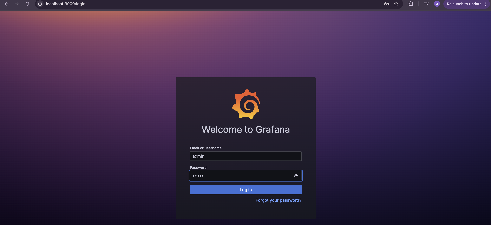</div><br/>

remember what we configure for the admin user? 
- user : admin
- password : admin

once logged in, there might be a dialogue requesting to change the default password, we can simply "skip" for now.
<div>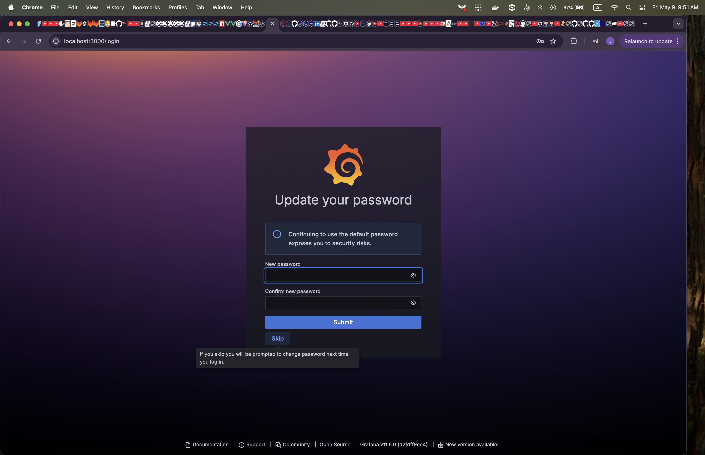</div><br/>

now it is time to create a `Data Source` under the `Connections` group. Pick `Add new connection` and pick ClickHouse; if everything is smooth the plugin should be installed and you would be able to see the `altinity data source`.
<div>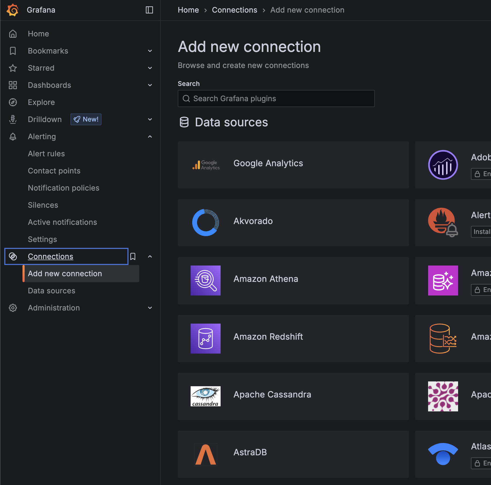</div><br/>

fill in the details for the setup
<div>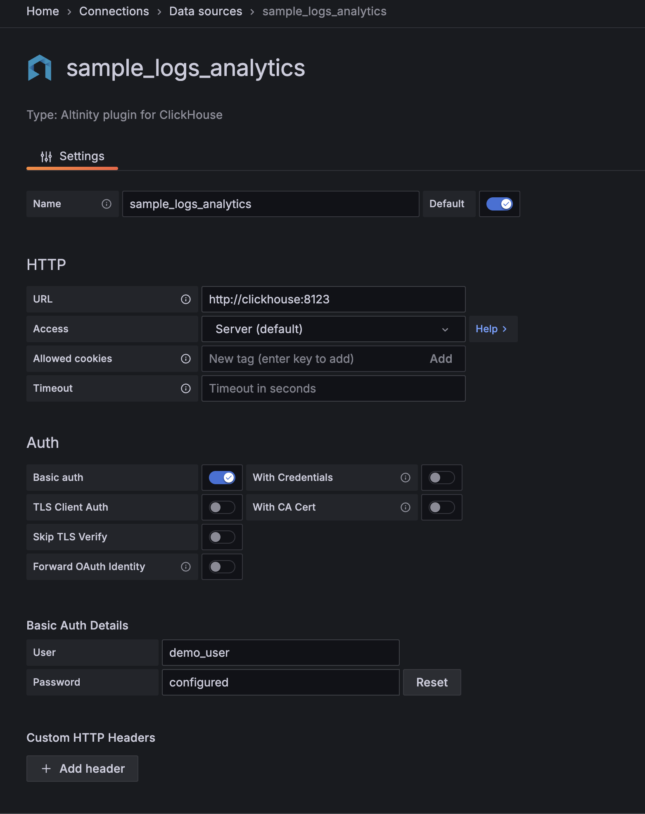</div><br/>

- name : the name of this data source
- url : the url of the ClickHouse instance, in our case `http://clickhouse:8123`, please remember we are not within a Docker environment, hence instead of applying `localhost`, we should use the container's name - which is `clickhouse`. If applying `localhost` the connectivity will fail.
- auth : choose `basic` and key in the username / password (demo_user / P@ssword1). Please make sure the username / password pair matches what we configured in the `clickhouse-init-db.sql` on [step 2](02-clickhouse.md)

let's test the connectivity by clicking the `Save and Test` button
<div>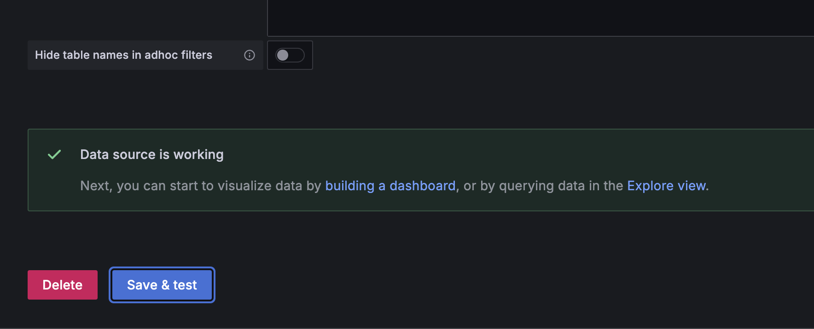</div><br/>

if all is good, we should see a success dialogue.

### ✅ 3. create a dashboard

let's click on the `create dashboard` button. We can choose `Add Visualisation` button next.
<div>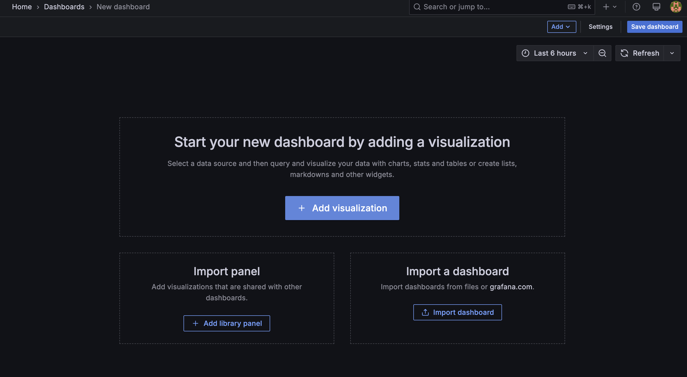</div><br/>

make sure picking the clickHouse connection created in the previous step.
<div>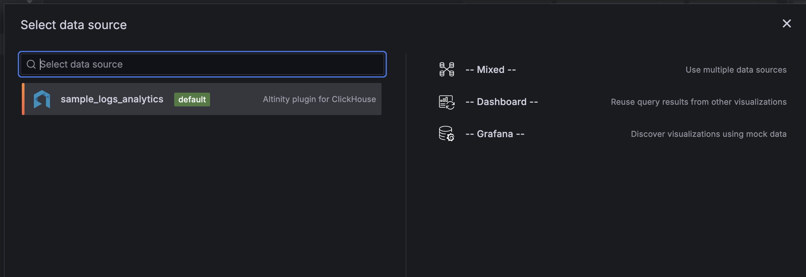</div><br/>

by default, the widget would be `time series` which is fine. We would be entering a SQL directly to generate the graph. Pick `SQL Editor` tab and key in the SQL
```sql
select timestamp, response_time from sample_logs_analytics order by timestamp
```
<div>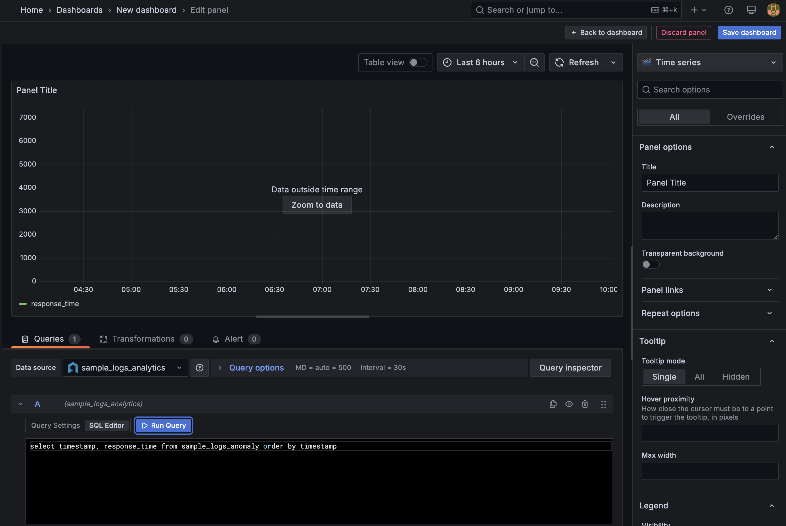</div><br/>

in case the widget is not showing any data (which is normal), click on `zoom data` and let Grafana auto fit the time range for displaying available data in the dataset (ClickHouse table in this case)
<div>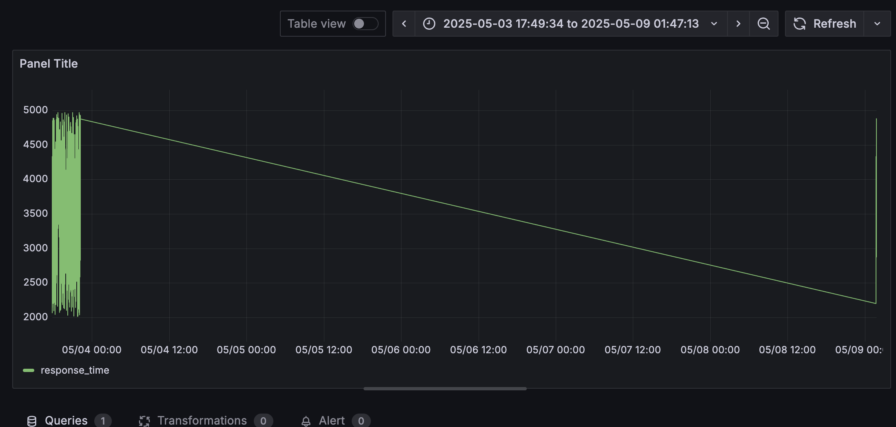</div><br/>

depends on when you run the Python data generator script; it could end up something like the above, feel free to select the time range to display a particular set of data.
<div>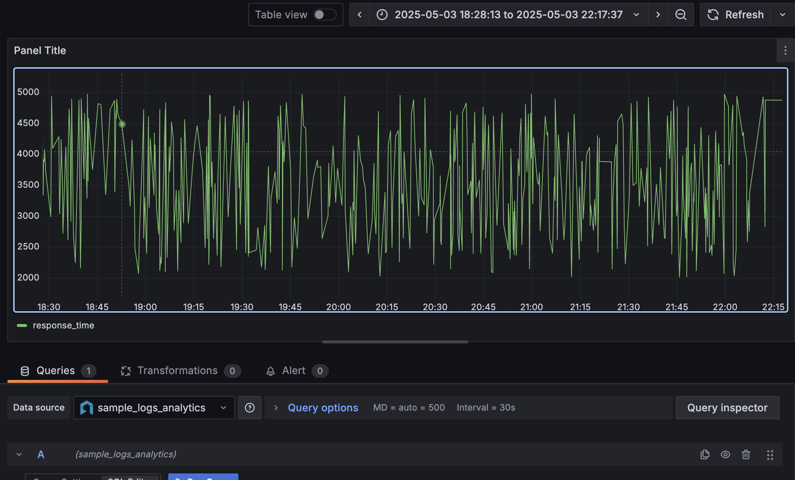</div><br/>

feel free to play around the settings of the graph and remember to `save dashboard`
<div>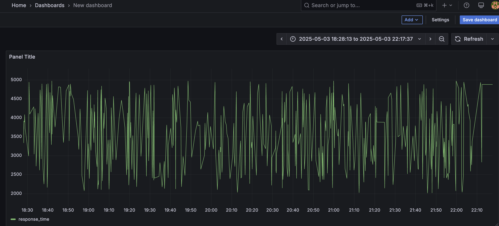</div><br/>

### ✅ 4. (optional) setup alerts

edit the widget, in the edit mode, hover to the `Alert` tab, choose `New alert rule`.
<div>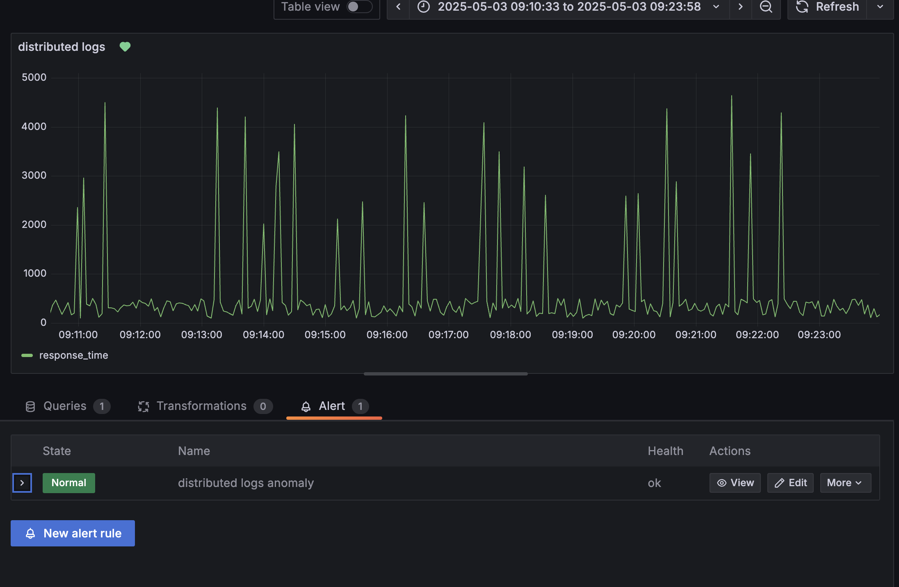</div><br/>

fill in the UI as follows (technically the Query part is pre-filled with the widget's SQL)
<div>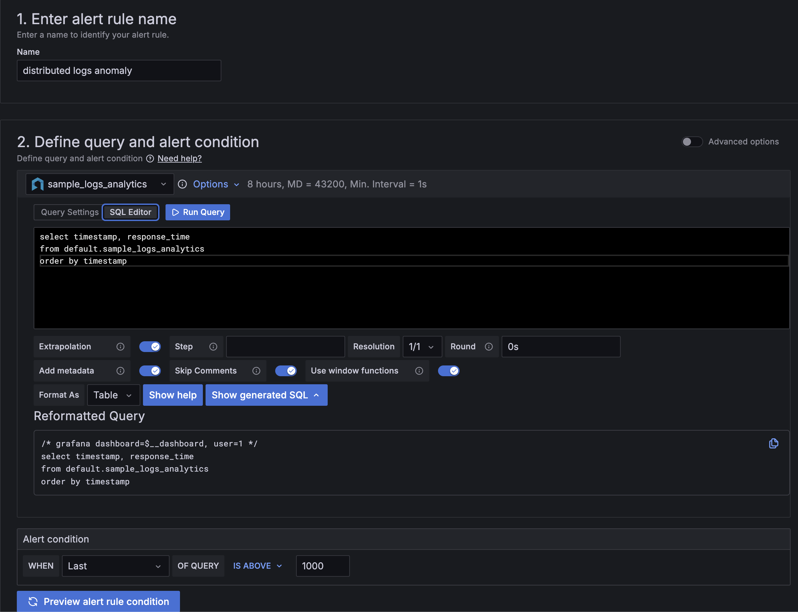</div><br/>
<div>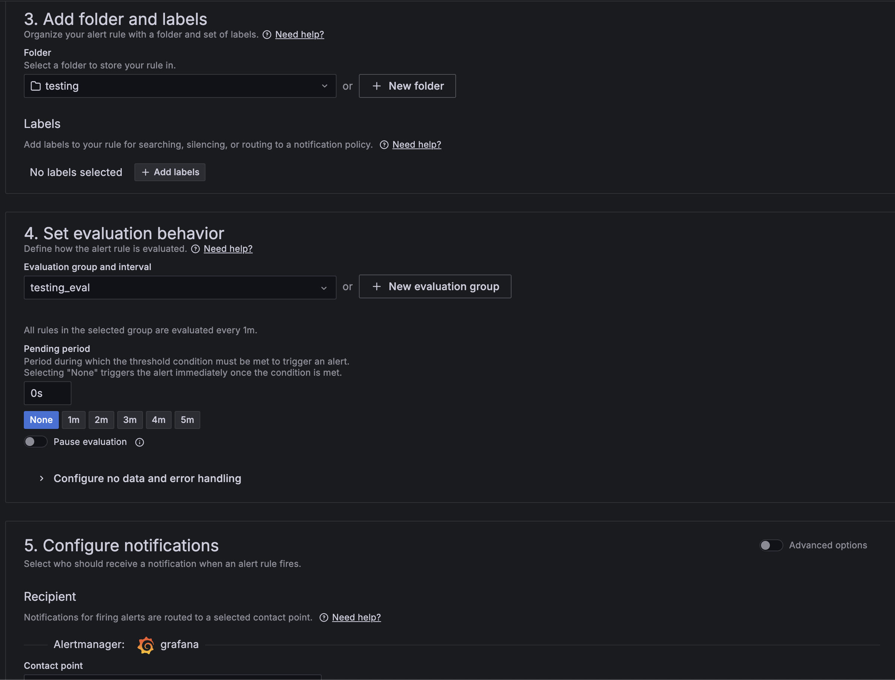</div><br/>
<div>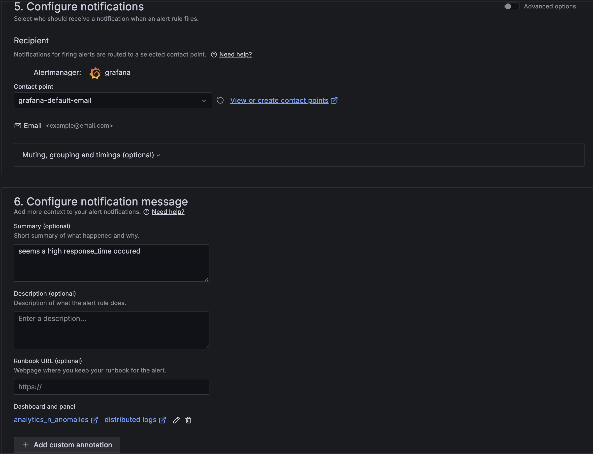</div><br/>

- Alert condition in this case is last value > 1000
- noticiations in this case would be choosing the `grafana-default-email`

PS. since it is a Docker environment plus the smtp server is not configured, hence even though alert(s) could be triggered but the email is never sent. However for the workshop's purpose, the above configuration walkthrough would play well to illustrate how alerts work.

<div style="text-align:center; margin-top: 20px; font-size: 20px;">

🔧 [prev - data generator](03-data-generator.md) &nbsp;&nbsp;&nbsp; 🔍 [next - ML](05-ml-anomaly.md)

</div>


